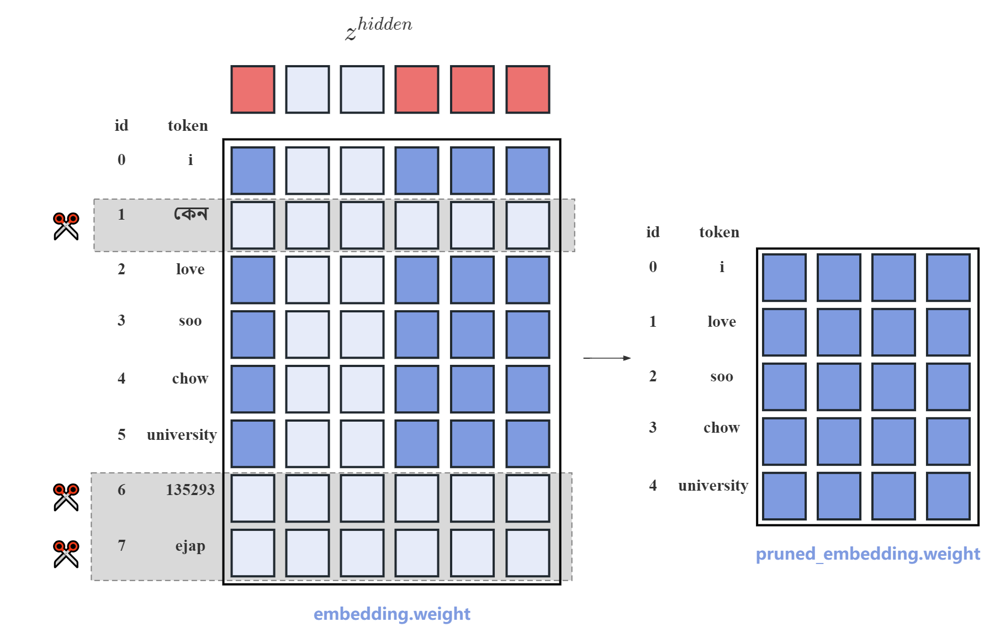

<!-- omit in toc -->
# LLama-Pruner (裁剪llama模型到任意指定配置结构)
[[中文版](README.md)] [[English](README_EN.md)]

着大模型的不断发展，以及算力的不断突破，模型的性能不断提升，但同时也伴随着参数量的不断提升。大参数量的模型虽然有较强的能力，但部署开销大，面对特定下游任务时，也几乎无法微调。因此，很多组织往往发布多个不同大小的模型供使用，例如3B，7B，13B，70B等等。而每个模型重新训练都需要2T或更多的token数量。因此，如果能够在不破坏模型能力的前提下将一个训练好的模型裁剪成不同大小进行复用，则能很大程度上节省成本。

该项目提供一套完整的代码以及可用工具来给Transformer结构下的预训练模型进行结构化剪枝。剪枝后的模型能够在少量数据（10B-20B tokens）的训练下即恢复原有模型大部分的语言能力，并在下游任务上进行微调。该方法有如下特点：
- **用户可以自定义裁剪结构：** 例如，可以将`hidden_size`从4096裁剪至3072，可以将`num_attention_heads`从32裁剪至24，将模型层数从32裁剪至28等等。用户可以通过裁剪获取任意指定结构，任意大小的transformer模型。
- **裁剪后的模型支持训练：** 非结构化剪枝一般获得一个稀疏模型，不支持再次训练，仅能用来推理。该方法裁剪后得到得模型无任何使用限制。

裁剪后的模型有如下作用：
- **直接获取一个高效推理的小模型：** 在我们得实验中，模型仅在开源的PILE数据集上进行10B-20B的训练就能有相当可观的能力，并在下游任务微调上也表现可观。
- **作为待训练模型的初始化，加快收敛速度：** 大模型可能需要2T或更多的训练数据，利用该裁剪方法作为初始化，可能仅需100B-200B较高质量的数据就能获得很好的效果。

以下是在LLama2模型上的恢复结果：
| Model | layer_num | hidden_size | intermediate_size | num_attention_heads | ml loss |
| :--- | :---: | :---: | :---: | :---: | :---: |
| LLaMA2-13B | 40 | 5120| 13824 | 40 | 1.50 (2T tokens)|
| LLaMA2-7B | 32 | 4096| 11006 | 32 | 1.54 (2T tokens)|
| Pruned-7B | 32 | 4096| 11006 | 32 | 1.56 (20B tokens) |
| Pruned-3.4B | 28 | 3072| 8192 | 28 | 1.71 (12B tokens) |

以下是同样配置的模型，由裁剪权重初始化和随机初始化模型的训练效果对比：


# 内容
以下是本项目的内容目录，涉及到模型裁剪，词表裁剪，Megatron框架高效训练LlaMA模型。
- [内容](#内容)
- [安装指南](#安装指南)
- [模型裁剪](#模型裁剪)
  - [深度裁剪](#深度裁剪)
  - [宽度裁剪](#宽度裁剪)
  - [使用教程](#使用教程)
- [词表裁剪](#词表裁剪)
  - [使用方法](#使用方法)
  - [说明](#说明)
- [大模型裁剪实验](#大模型裁剪实验)
  - [收敛情况](#收敛情况)
  - [训练过程表现](#训练过程表现)
  - [微调表现](#微调表现)
- [相关工作](#相关工作)
- [引用](#引用)

# 安装指南

推荐使用docker安装环境。
类似于Megatron-LM，推荐使用带有DXG节点的[NGC&#39;s PyTorch container](https://ngc.nvidia.com/catalog/containers/nvidia:pytorch)的版本。为了可以成功运行PyTorch，可以按照以下步骤操作：

1、安装docker和nvidia-docker

2、执行下列的Docker命令：

```bash
docker pull nvcr.io/nvidia/pytorch:23.12-py3
docker run --gpus all --shm-size=128g --net=host -dit --rm --name megatron -v /your_dir:/your_dir -v /root/.ssh:/root/.ssh nvcr.io/nvidia/pytorch:23.12-py3
```

3、安装sentencepiece and nltk
```bash
pip install SentenecPiece
pip install nltk
```


# 模型裁剪
本方法支持将一个Transformer预训练模型裁剪成一个任意大小的新预训练模型并保留大部分性能。对于一个transformer模型，参数量大小由 ```layer_num, hidden_size, intermediate_size, num_attention_heads```决定。使用此份代码，只需要设置新的``drop_layers,hidden_size_remain,intermediate_size_remain```,```num_attetion_heads_remain``即可将模型裁剪为更小的模型。 

以Llama为例：
| Model | layer_num | hidden_size | intermediate_size | num_attention_heads | 
| :--- | :---: | :---: | :---: | :---: |
| LLaMA-13B | 40 | 5120| 13824 | 40 |
| LLaMA-7B | 32 | 4096| 11006 | 32 | 
| LLaMA-3.4B | 28 | 3072| 8192 | 24 | 
| LLaMA-2.7B | 24 | 2560| 6912 | 20 | 

由于没有对kv_channel进行裁剪，并且llama使用了 SwiGLU-MLP，因此hidden_size与intermediate_size以及num_attention_heads都存在一定比例的对应关系。建议裁剪时先选定hidden_size，然后再计算对应的intermediate_size以及num_attention_heads。

## 深度裁剪
该方法与经典的layerdrop方法相同，通过drop_layers参数可以设定你需要裁剪的层编号。我们进行了一些前期实验，对于固定的裁剪层数，往往从中间裁剪对模型的伤害更小，裁剪的层间隔越远对模型的伤害越小。例如，对于层编号从0开始的12层的transformer如果需要裁剪2层，裁剪4，7两层效果较好。

## 宽度裁剪
该方法将原始模型通过结构化权重裁剪，裁剪成任意大小的模型。例如，对于一个 [n,m] 的矩阵，如果将其裁剪成 [n-a,m-b] 大小的矩阵，将随机裁剪掉 a 行和 b 列的参数。
但实际上, Transformer结构中的权重矩阵有严格的依赖关系。例如，在计算过程中，对于初始向量 x, 会经过多层的网络。例如 $x_1 = x_0AB$ 其中A和B的矩阵相乘存在行列的依赖关系。对于大小为```hidden_size``` 的向量 $x_0$，如果裁剪掉第 i 个位置, 那么 向量A以及向量B分别需要裁剪掉第 i 行以及第 i 列， 这能使得裁剪后矩阵的计算结果在除了 i 位置以外的其他位置保持一致。这份代码会生成随机的裁剪位置，并按照transformer的计算方式进行位置对应的结构化裁剪。
具体的裁剪过程如下图：


本方法会自动生成与配置大小相匹配的随机掩码向量$z$。例如，如果要将`hidden_size`从2048裁剪至1024，则$z^{hidden}$的形状为[2048,1]。$sum(z^{hidden})=1024$。所有涉及到与`hidden_size`进行计算的矩阵都需要按照$z^{hidden}$进行裁剪。这会使得$z^{hidden}$值为1的元素下标对应的神经元的计算方式几乎不发生改变。

具体的，以HuggingFace中LLaMA模型每一层SwiGLUMLP的裁剪为例：
```python
def prune_linear_by_index(module:nn.Linear, row_index=None, column_index=None):
    if row_index is not None:
        module.weight.data = torch.index_select(module.weight.data,0, row_index)
    if column_index is not None:
        module.weight.data = torch.index_select(module.weight.data,-1, column_index)

class LlamaMLP(nn.Module):
    def __init__(self, config):
        super().__init__()
        self.config = config
        self.hidden_size = config.hidden_size
        self.intermediate_size = config.intermediate_size
        self.gate_proj = nn.Linear(self.hidden_size, self.intermediate_size, bias=False)
        self.up_proj = nn.Linear(self.hidden_size, self.intermediate_size, bias=False)
        self.down_proj = nn.Linear(self.intermediate_size, self.hidden_size, bias=False)
        self.act_fn = ACT2FN[config.hidden_act]

    def prune(self,zs,layer_num):
        hidden_index = zs["hidden_index"]
        intermediate_index = zs["intermediate_indexes"][layer_num-1]

        # w1 cat w3 == dense_h_to_4h, w2 = dense_4h_to_h

        # expand intermediate_index 
        prune_linear_by_index(self.gate_proj,intermediate_index,hidden_index)
        prune_linear_by_index(self.up_proj,intermediate_index,hidden_index)
        prune_linear_by_index(self.down_proj)
```

## 使用教程
<!-- omit in toc -->
### Megatron(推荐使用)
该项目主要针对较大模型，而许多7B，13B及以上模型都使用Megatron架构进行训练，对于更大的模型，单张GPU甚至无法容纳全部参数。
因此我们实现了基于Megatron框架的llama结构模型裁剪代码以及训练代码。该代码支持从300M至130B模型的裁剪与训练。支持张量并行下模型分布式参数裁剪。
<!-- omit in toc -->
#### 步骤1
将llama的huggingface模型权重转化成megatron模型权重
```
bash tools/checkpoint_conversion/hf_to_megatron.sh
```
可以任意设置的tensor_parallel_size，该方法支持张量并行下的权重裁剪。
<!-- omit in toc -->
#### 步骤2
megatron模型裁剪，参考脚本 ```scripts/prune_llama.sh```
```
bash scripts/prune_llama.sh
```
- `--load`: 待裁剪的megatron模型路径。
- `GPT_ARGS`: 所有参数均与原模型参数保持一致即可。
- `PRUNE_ARGS`
    - `--hidden_size_remain`: 裁剪后的 hiddens_size。
    - `--num_attention_heads_remain`: 裁剪后的 attention_heads。
    - `--ffn_hidden_size_remain`:  裁剪后的ffn_hidden_size。
    - `--drop_layers`: 需要裁剪的层数编号，从0开始。
    - `--prune_type`: 默认为 "balance"。由于对于较大的模型是在张量并行下裁剪，要裁剪的行或列可能不在一台GPU上。“balance” 裁剪会让每台GPU上裁剪相同个数的行或者列。即裁剪后，每个子模型大小完全一致。若不使用“balance”则可能每个子模型大小不一致，需要使用transfer.sh脚本转化为tp1的模型。
<!-- omit in toc -->
#### 步骤3
裁剪完的模型需要进行少量的恢复训练即能恢复大部分的能力.
模型继续训练的脚本如下：
```
bash scripts/check_model.sh
```
如果模型已经裁剪的足够小，则原本张量并行的模型也可以单卡进行训练。可以利用如下脚本更改张量并行大小：
```
bash scripts/transfer.sh
```

<!-- omit in toc -->
### HuggingFace
为了方便用户使用，也为了更好理解裁剪工作原理，我们直接基于HuggingFace的modeling_llama.py实现了llama的裁剪代码，并提供了参考代码。用户只需要提供llama模型的路径，并在config文件中设置裁剪后模型的期望大小即可。
```
cd prune_hf
python prune_llama.py \
  --model_name_or_path {model path} \
  --prune_config_path {size of the new model} \
  --output_path {path to save the pruned model}
```

# 词表裁剪
大模型的词表大小很大，并且由于hidden_size也较大，通常为2048或4096，整个embedding权重的大小为vocab_size * hidden_size。以多语言模型Multi-Lingual T5为例，词表大小约260000。总参数量约为1.1B。但如果仅用于中英文任务，有大量词表不会被使用到，造成很大的空间浪费。本项目提供了一套裁剪SentencePiece分词器的方法，并同时裁剪模型的embedding权重。通过词频排序的方法，选择在后续使用过程中模型几乎不会碰到的token并将其剔除，并裁剪对应的embedding权重。方法示意图如下：



我们对llama2-7B模型在MMLU上进行了测试，我们选取在MMLU数据集上出现频率最高的15000个token，将原本llama的词表从32000裁剪至15000。裁剪后模型表现由42.33变为42.21

## 使用方法
首先确定模型后续使用的数据集。例如，如果模型后续仅作中文用途，则可以用中文预训练数据集。使用```get_vocab_freq.py```来进行词频统计，并设置新词表大小，来选择留下的词汇：
```
cd emb_pruner/llama_emb_pruner
bash get_vocab_freq.sh
```
上述脚本会生成```remain_vocab_ids.pt```，存储一个列表，为保留的token原本的id。接下来根据保留的id裁剪词表和模型对应的embedding，lm_head。
```
bash prune_spm_and_emb.py
```

## 说明
- 上述代码为使用SentencePiece的模型裁剪方法。对于使用tiktoken分词的模型，例如Qwen系列，我们也进行了开发，但是似乎由于tiktoken本身无法添加unknown token，导致裁剪后对于不常见的词汇，core_bpe分词器会报错，暂时无法正确使用。
- 原则上来说不建议随意更改原有的BPE分词模型，该方法只是一次简单尝试。更改分词器以及embedding后的模型在后续训练中会遇到哪些问题暂时还未完全探索。但我们对于15B的T5模型将词表从26W裁剪到5W，同时进行深度裁剪后的恢复训练，训练了10B tokens，训练loss曲线正常。

# 大模型裁剪实验
我们在目前最流行的llama模型上进行了实验，分别将llama2-13B裁剪至7B以及llama2-7B裁剪至3.5B.

我们在开源的pile数据集对裁剪后模型的恢复训练。
以下是具体的模型参数以及恢复训练后的ml loss：

| Model | layer_num | hidden_size | intermediate_size | num_attention_heads | ml loss |
| :--- | :---: | :---: | :---: | :---: | :---: |
| LLaMA2-13B | 40 | 5120| 13824 | 40 | 1.50 |
| LLaMA2-7B | 32 | 4096| 11006 | 32 | 1.54 |
| Pruned-7B | 32 | 4096| 11006 | 32 | 1.56 (20B tokens) |
| Pruned-3.4B | 28 | 3072| 8192 | 28 | 1.71 (12B tokens) | 
## 收敛情况
<!-- omit in toc -->
### 不同大小模型裁剪后的loss比较


| Model | 4B| 8B | 12B |16B | 20B |
| :--- | :---: | :---: | :---: | :---: | :---: |
| Pruned-7B | 1.700 | 1.642| 1.616 | 1.587 | 1.553 |
| Pruned-3.4B | 1.839 | 1.746| 1.713 | - | - | 

从训练的loss来看，模型尚未完全收敛，若训练更多的数据的话还有较大的提升空间。
<!-- omit in toc -->
## 下游任务表现

所有的测评结果均使用lm-evaluation-harness代码仓库获得。

| Models | #tokens for training | SciQ | PIQA | WinoGande |ARC-E | ARC-C(25) | HellaSwag(10) |
| :--- | :---: | :---: | :---: | :---: | :---: | :---: | :---: | 
| LLaMA2-7B | 2T | 93.7 | 78.1 | 69.3 | 76.4 | 53.0 | 78.6 |
| OPT2.7B | 300B | 85.8 | 73.7 | 60.8 | 60.8 | 34.0 | 61.5 |
| Pythia2.8B | 300B | 88.3 | 74.0 | 59.7 | 64.4 | 36.4 | 60.8 |
| INCITE-Base-3B | 800B | 90.7 | 74.6 | 63.5 | 67.7 | 40.2 | 64.8 |
| Open-LLaMA-3B-v1 | 1T | 91.3 | 73.7 | 61.5 | 67.6 | 39.6 | 62.6 |
| Open-LLaMA-3B-v2 | 1T | 91.8 | 76.2 | 63.5 | 66.5 | 39.0 | 67.6 |
| Qwen-1.8B | 2T | 92.2 | 73.5 | 59.1 | 63.6 | 38.4 | 60.8 |
| Pruned-7B | 20B | 91.8 | 76.2 | 65.2 | 68.6 | 45.7 | 70.4 |
| Pruned-3.4B | 12B | 88.8 | 72.2 | 60.7 | 61.1 | 36.6 | 60.8 |

| Models | #tokens for training | LogiQA | BoolQ(32) | LAMBADA  | MMLU (5) |
| :--- | :---: | :---: | :---: | :---:  | :---: | 
| LLaMA2-7B | 2T | 30.7 | 82.1 | 28.8  | 46.6 |
| OPT2.7B | 300B | 26.0 | 63.4 | 63.6  | 25.9 |
| Pythia2.8B | 300B | 28.0 | 66.0 | 64.7  | 26.9 |
| INCITE-Base-3B | 800B | 27.7 | 65.9 | 65.3  | 27.0 |
| Open-LLaMA-3B-v1 | 1T | 28.4 | 70.0 | 65.4  | 27.0 |
| Open-LLaMA-3B-v2 | 1T | 28.1 | 69.6 | 66.5  | 26.9 |
| Qwen-1.8B| 2T | 31.6 | 66.7 | 57.0 | 44.8 | 
| Pruned-7B | 20B | 27.4 | 74.1 | 68.7 | 31.6 |
| Pruned-3.4B | 12B | 29.2 |67.1 | 61.9  | 27.6 |

 <!-- omit in toc -->
## 训练过程表现
TODO
## 微调表现
TODO

# 相关工作

# 引用
