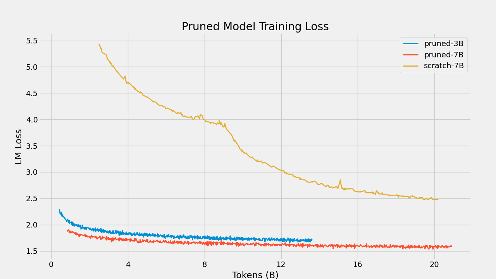
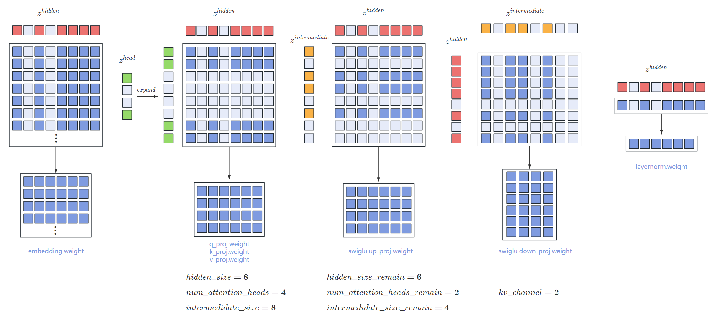

<!-- omit in toc -->
<!-- # ✂️Pruning LLMs (Pruning LLMs to Any Config) -->
<p align="center"><h1 align="center">✂️Pruning LLMs (Pruning LLMs to Any Config)</h1></p>

<p align="center">
    <a href="https://github.com/jordddan/Pruning-LLMs/blob/main/LICENSE"></a>
    <a href="https://huggingface.co/jorjordan"></a>
    <a href="https://opennlg.cn/"></a>
</p>

[[中文版](README.md)] [[English](README_EN.md)]

With the continuous development of large models and the breakthroughs in computing power, model performance continues to improve. However, this improvement comes with the continuous increase in the number of parameters. While large models have strong capabilities, they come with high deployment costs and are almost impossible to fine-tune for specific downstream tasks due to their enormous size. Therefore, many organizations often release multiple models of different sizes for use, such as 3B, 7B, 13B, 70B, and so on. Each model retraining requires 2T or more tokens. Therefore, being able to prune a pre-trained model into different sizes without compromising its capabilities can significantly save costs.

<p align="center">

</p>

This project provides a complete set of code and tools to perform structured pruning on pre-trained models with Transformer architecture. The pruned models can recover most of the language abilities of the original model with training on a small amount of data (10B-20B tokens) and can be fine-tuned on downstream tasks. The method has the following features:
- **Customizable Pruning Structure:** For example, you can prune `hidden_size` from 4096 to 3072, prune `num_attention_heads` from 32 to 24, prune the number of layers from 32 to 28, and so on. Users can obtain any specified structure and size of the Transformer model through pruning.
- **Pruned Models Support Training:** Unstructured pruning generally results in a sparse model that cannot be retrained and can only be used for inference. The method presented here produces pruned models that can be trained again without any usage restrictions.

The pruned models have the following applications:
- **Directly obtain an efficient, small model for inference:** In our experiments, the model trained on the open-source PILE dataset with only 10B-20B tokens shows considerable language capabilities and performs well in downstream fine-tuning tasks.
- **Use as an initialization for models to speed up convergence:** Large models may require 2T or more training data. By using this pruning method as an initialization, satisfactory results can be achieved with only 100B-200B high-quality data.

The following are the recovery results on the LLama2 model:
| Model | layer_num | hidden_size | intermediate_size | num_attention_heads | ml loss |
| :--- | :---: | :---: | :---: | :---: | :---: |
| LLaMA2-13B | 40 | 5120| 13824 | 40 | 1.50 (2T tokens)|
| LLaMA2-7B | 32 | 4096| 11006 | 32 | 1.54 (2T tokens)|
| Pruned-7B | 32 | 4096| 11006 | 32 | 1.56 (20B tokens) |
| Pruned-3.4B | 28 | 3072| 8192 | 28 | 1.71 (12B tokens) |

The models with the same configuration were compared for training results between the pruned weights and randomly initialized weights:

<p align="center">

</p>

# Table of Contents
Here is the table of contents for this project, covering model pruning, vocabulary pruning, and efficient training of LlaMA models using the Megatron framework.
- [Table of Contents](#table-of-contents)
- [Installation Guide](#installation-guide)
- [Model Pruning](#model-pruning)
  - [Depth Pruning](#depth-pruning)
  - [Width Pruning](#width-pruning)
  - [Usage Tutorial](#usage-tutorial)
- [Vocabulary Pruning](#vocabulary-pruning)
  - [Usage Method](#usage-method)
  - [Explanation](#explanation)
- [Large Model Pruning Experiment](#large-model-pruning-experiment)
  - [Convergence](#convergence)
  - [Training Process Performance](#training-process-performance)
  - [Fine-tuning Performance](#fine-tuning-performance)
- [Related Work](#related-work)
- [References](#references)

# Open Source

We have open-sourced the 7B model pruned from the LLaMA2-13B model, the 3B model pruned from the LLaMA2-7B model, and the model fine-tuned on the downstream multi-task named entity recognition.
- prune-llama-7B: [link](https://huggingface.co/jorjordan/pruned-llama-7B)
- prune-llama-3B: [link](https://huggingface.co/jorjordan/pruned-llama-3B)
- pruned-llama3B-ner: TODO
- openba-llama3B-ner:TODO

# Installation Guide

It is recommended to use Docker for environment installation. Similar to Megatron-LM, it is recommended to use the version of [NGC's PyTorch container](https://ngc.nvidia.com/catalog/containers/nvidia:pytorch) with the DXG node. To successfully run PyTorch, follow these steps:

1. Install Docker and nvidia-docker.

2. Execute the following Docker commands:

```bash
docker pull nvcr.io/nvidia/pytorch:23.12-py3
docker run --gpus all --shm-size=128g --net=host -dit --rm --name megatron -v /your_dir:/your_dir -v /root/.ssh:/root/.ssh nvcr.io/nvidia/pytorch:23.12-py3
```

3. Install SentencePiece and NLTK:

```bash
pip install SentencePiece
pip install nltk
```

# Model Pruning
This method supports pruning a pre-trained Transformer model into a new pre-trained model of any size while preserving most of its performance. For a Transformer model, the parameter size is determined by `layer_num, hidden_size, intermediate_size, num_attention_heads`. Using this code, you only need to set the new values for `drop_layers, hidden_size_remain, intermediate_size_remain`, and `num_attention_heads_remain` to prune the model into a smaller one.

For example, for LLaMA:
| Model | layer_num | hidden_size | intermediate_size | num_attention_heads | 
| :--- | :---: | :---: | :---: | :---: |
| LLaMA-13B | 40 | 5120| 13824 | 40 |
| LLaMA-7B | 32 | 4096| 11006 | 32 | 
| LLaMA-3.4B | 28 | 3072| 8192 | 24 | 
| LLaMA-2.7B | 24 | 2560| 6912 | 20 | 

Since there is no pruning for kv_channel, and LLaMA uses SwiGLU-MLP, there is a certain proportional relationship between hidden_size, intermediate_size, and num_attention_heads. It is recommended to choose hidden_size first and then calculate the corresponding intermediate_size and num_attention_heads.

## Deep Pruning
This method is similar to the classical layerdrop method, and you can specify the layer numbers to be pruned using the `drop_layers` parameter. Preliminary experiments have shown that pruning from the middle has less impact on the model, and pruning layers with larger intervals has less impact on the model. For example, for a transformer with 12 layers starting from layer 0, if you need to prune 2 layers, pruning layers 4 and 7 has better results.

## Width Pruning
This method prunes the original model through structured weight pruning, creating a model of any size. For example, for an [n, m] matrix, if it is pruned to a [n-a, m-b] matrix, it randomly prunes a rows and b columns of parameters.
However, in reality, the weight matrices in the Transformer structure have strict dependencies. For example, in the calculation process, for the initial vector x, it goes through multiple layers of the network. For example, $x_1 = x_0AB$ where matrices A and B have dependencies on rows and columns. For a vector $x_0$ of size `hidden_size`, if the i-th position is pruned, both vector A and vector B need to prune the i-th row and column, respectively. This ensures that the calculation results of the pruned matrix remain consistent in all positions except for position i. This code generates a random pruning position and performs structured pruning according to the calculation method of the transformer.
The specific pruning process is shown in the figure below:
<p align="center">

</p>

This method will automatically generate a random mask vector $z$ matching the configuration size. For example, if you want to prune `hidden_size` from 2048 to 1024, the shape of $z^{hidden}$ is [2048, 1], and $sum(z^{hidden})=1024$. All matrices involved in the calculation with `hidden_size` need to be pruned according to $z^{hidden}$, making the calculation almost unchanged for elements with $z^{hidden}$ value of 1.

Specifically, for the pruning of each layer's SwiGLUMLP in the HuggingFace LLaMA model:
```python
def prune_linear_by_index(module: nn.Linear, row_index=None, column_index=None):
    if row_index is not None:
        module.weight.data = torch.index_select(module.weight.data, 0, row_index)
    if column_index is not None:
        module.weight.data = torch.index_select(module.weight.data, -1, column_index)

class LlamaMLP(nn.Module):
    def __init__(self, config):
        super().__init__()
        self.config = config
        self.hidden_size = config.hidden_size
        self.intermediate_size = config.intermediate_size
        self.gate_proj = nn.Linear(self.hidden_size, self.intermediate_size, bias=False)
        self.up_proj = nn.Linear(self.hidden_size, self.intermediate_size, bias=False)
        self.down_proj = nn.Linear(self.intermediate_size, self.hidden_size, bias=False)
        self.act_fn = ACT2FN[config.hidden_act]

    def prune(self, zs, layer_num):
        hidden_index = zs["hidden_index"]
        intermediate_index = zs["intermediate_indexes"][layer_num - 1]

        # w1 cat w3 == dense_h_to_4h, w2 = dense_4h_to_h

        # expand intermediate_index
        prune_linear_by_index(self.gate_proj, intermediate_index, hidden_index)
        prune_linear_by_index(self.up_proj, intermediate_index, hidden_index)
        prune_linear_by_index(self.down_proj)
```

## Usage Tutorial
<!-- omit in toc -->
### Megatron (Recommended)
This project mainly targets larger models, and many 7B, 13B, and above models use the Megatron architecture for training. For larger models, a single GPU may not even accommodate all parameters. Therefore, pruning and training code for llama-structured models based on the Megatron framework has been implemented. The code supports pruning and training from 300M to 130B models. It also supports tensor parallelism for distributed parameter pruning.

<!-- omit in toc -->
#### Step 1
Convert the llama's huggingface model weights to megatron model weights:
```bash
bash tools/checkpoint_conversion/hf_to_megatron.sh
```
You can set `tensor_parallel_size` arbitrarily. This method supports weight pruning under tensor parallelism.

<!-- omit in toc -->
#### Step 2
Prune the megatron model, refer to the script `scripts/prune_llama.sh`:
```bash
bash scripts/prune_llama.sh
```
- `--load`: Path to the megatron model to be pruned.
- `GPT_ARGS`: All parameters remain consistent with the original model parameters.
- `PRUNE_ARGS`
    - `--hidden_size_remain`: Pruned hidden_size.
    - `--num_attention_heads_remain`: Pruned

 attention_heads.
    - `--ffn_hidden_size_remain`: Pruned ffn_hidden_size.
    - `--drop_layers`: Layer numbers to be pruned, starting from 0.
    - `--prune_type`: Default is "balance". Since pruning for larger models is done under tensor parallelism, rows or columns to be pruned may not be on the same GPU. "Balance" pruning ensures that an equal number of rows or columns are pruned on each GPU, resulting in identical sizes for each sub-model after pruning. If "balance" is not used, each sub-model may have different sizes, and you need to use the `transfer.sh` script to convert it to a tp1 model.

<!-- omit in toc -->
#### Step 3
The pruned model needs a small amount of fine-tuning to restore most of its capabilities. The script for continuing training is as follows:
```bash
bash scripts/check_model.sh
```
If the model has been pruned small enough, the tensor-parallel model can also be trained on a single GPU. You can use the following script to change the tensor parallel size:
```bash
bash scripts/transfer.sh
```

<!-- omit in toc -->
### HuggingFace
For user convenience and better understanding of the pruning process, the pruning code for llama based on HuggingFace's `modeling_llama.py` has been directly implemented, and reference code is provided. Users only need to provide the path of the llama model and set the expected size of the pruned model in the config file:
```bash
cd prune_hf
python prune_llama.py \
  --model_name_or_path {model path} \
  --prune_config_path {size of the new model} \
  --output_path {path to save the pruned model}
```

# Vocabulary Pruning
The vocabulary size of large models is very large, and due to the large hidden_size (usually 2048 or 4096), the size of the entire embedding weight is `vocab_size * hidden_size`. For example, the vocabulary size of the Multi-Lingual T5 model is about 260,000. The total parameter size is about 1.1B. However, if it is only used for Chinese-English tasks, a large number of vocabulary will not be used, resulting in significant space wastage. This project provides a set of methods to prune the SentencePiece tokenizer and simultaneously prune the model's embedding weights. By selecting tokens that the model is unlikely to encounter during subsequent usage through frequency sorting, it removes them and prunes the corresponding embedding weights. The method is illustrated in the figure below:
<p align="center">

</p>

We tested the llama2-7B model on the MMLU dataset, selecting the top 15,000 tokens with the highest frequency on the MMLU dataset, and pruning the original llama vocabulary from 32,000 to 15,000. The performance of the pruned model changed from 42.33 to 42.21.

## Usage
First, determine the dataset the model will be used with in the future. For example, if the model will only be used for Chinese, you can use a Chinese pre-training dataset. Use `get_vocab_freq.py` to perform frequency statistics and set the new vocabulary size to select the retained vocabulary:
```bash
cd emb_pruner/llama_emb_pruner
bash get_vocab_freq.sh
```
The above script will generate `remain_vocab_ids.pt`, storing a list of original token IDs to be retained. Then, prune the vocabulary and corresponding embedding and lm_head of the model based on the retained IDs:
```bash
bash prune_spm_and_emb.py
```

## Note
- The above code is for pruning models using the SentencePiece tokenizer. For models using the tiktoken tokenizer, such as the Qwen series, we have also developed code. However, it seems that due to the inability of tiktoken to add an unknown token, pruning with random generation may cause an error in the core_bpe tokenizer, and it cannot be used correctly for now.
- In principle, it is not recommended to arbitrarily change the original BPE tokenizer. This method is just a simple attempt. The problems that may be encountered when changing the tokenizer and embedding of the model in subsequent training have not been fully explored. However, for the 15B T5 model, pruning the vocabulary from 260,000 to 50,000 and performing deep pruning, training with 100B tokens, the training loss curve is normal.

# Large Model Pruning Experiment
We conducted experiments on the most popular llama models, pruning llama2-13B to 7B, and llama2-7B to 3.5B.

We performed fine-tuning on the pruned models on the open-source Pile dataset.
The specific model parameters and fine-tuning loss after recovery are as follows:

| Model | layer_num | hidden_size | intermediate_size | num_attention_heads | ml loss |
| :--- | :---: | :---: | :---: | :---: | :---: |
| LLaMA2-13B | 40 | 5120| 13824 | 40 | 1.50 |
| LLaMA2-7B | 32 | 4096| 11006 | 32 | 1.54 |
| Pruned-7B | 32 | 4096| 11006 | 32 | 1.56 (20B tokens) |
| Pruned-3B | 28 | 3072| 8192 | 28 | 1.71 (12B tokens) | 

## Convergence
<!-- omit in toc -->
### Comparison of loss after pruning models of different sizes


| Model | 4B| 8B | 12B |16B | 20B |
| :--- | :---: | :---: | :---: | :---: | :---: |
| Pruned-7B | 1.700 | 1.642| 1.616 | 1.587 | 1.553 |
| Pruned-3B | 1.839 | 1.746| 1.713 | - | - | 

From the training loss, it can be seen that the model has not completely converged. If more data is trained, there is still a large room for improvement.

<!-- omit in toc -->
## Downstream Task Performance

To ensure fairness in comparison， all evaluation results were obtained using the [lm-evaluation-harness](https://github.com/EleutherAI/lm-evaluation-harness).

| Models | #tokens for training | SciQ | PIQA | WinoGande |ARC-E | ARC-C(25) | HellaSwag(10) | LogiQA | BoolQ(32)  | MMLU (5) | AVG |
| :--- | :---: | :---: | :---: | :---: | :---: | :---: | :---: | :---: | :---:   | :---: | :---: | 
| LLaMA2-7B | 2T | 93.7 | 78.1 | 69.3 | 76.4 | 53.0 | 78.6 | 30.7 | 82.1   | 46.6 | 67.61 |
| OPT2.7B | 300B | 85.8 | 73.7 | 60.8 | 60.8 | 34.0 | 61.5 | 26.0 | 63.4   | 25.9 | 54.6 |
| Pythia2.8B | 300B | 88.3 | 74.0 | 59.7 | 64.4 | 36.4 | 60.8 | 28.0 | 66.0   | 26.9 | 58.5 |
| INCITE-Base-3B | 800B | 90.7 | 74.6 | 63.5 | 67.7 | 40.2 | 64.8 | 27.7 | 65.9   | 27.0 | 58.0 |
| Open-LLaMA-3B-v1 | 1T | 91.3 | 73.7 | 61.5 | 67.6 | 39.6 | 62.6 | 28.4 | 70.0   | 27.0 | 57.9 |
| Open-LLaMA-3B-v2 | 1T | 91.8 | 76.2 | 63.5 | 66.5 | 39.0 | 67.6 | 28.1 | 69.6   | 26.9 | 58.8 |
| Qwen-1.8B | 2T | 92.2 | 73.5 | 59.1 | 63.6 | 38.4 | 60.8 | 31.6 | 66.7  | 44.8 | 59.0 |
| Pruned-7B | 20B | 91.8 | 76.2 | 65.2 | 68.6 | 45.7 | 70.4 | 27.4 | 74.1  | 31.6 | 61.3 |
| Pruned-3B | 12B | 88.8 | 72.2 | 60.7 | 61.1 | 36.6 | 60.8 | 29.2 | 67.1   | 27.6 | 56.0 |

## Fine-Tuning Performance
TODO

# Related Work
- [Cofi-Pruner](https://github.com/princeton-nlp/CoFiPruning): Prune BERT models using a training-based pruning mask.

- [Sheard-LLaMA](https://github.com/princeton-nlp/LLM-Shearing): Similar to Cofi-Pruner, prune llama models using a training-based pruning mask, and propose a new data recovery strategy. The difference between this project and these two projects is that the mask in this project is generated randomly and does not require any training. Moreover, even with randomly generated masks and coarse-grained data available, large language models can recover successfully. Additionally, this project provides pruning for Megatron framework-based tensor-parallel models, which means that if a model cannot fit on a single GPU, it can still be pruned and trained.

- [Megatron-LM](https://github.com/NVIDIA/Megatron-LM): LLaMA is trained based on the Megatron framework.

- [OpenBA](https://github.com/OpenNLG/OpenBA): Open-sourced 15B-sized Encoder-Decoder Chinese-English model.

- [OpenBA-v2](https://github.com/OpenNLG/OpenBA): This project is an early experiment for OpenBA-v2. OpenBA-v2 uses this project's model pruning framework to prune a 15B OpenBA model to 3.5B. With multi-stage pruning recovery, nearly 80% of the model parameters are pruned. Training with only 100B of recovery data outperforms most models trained on open-source data. We will soon open-source the model training code and model parameters.

- [Megatron-CookBook](https://github.com/dwzq-com-cn/LLM-Megatron-Cookbook): An efficient repository based on Megatron for training large-scale models, including model pre-training, fine-tuning, compression, length extension, and large model multi-teacher distillation.