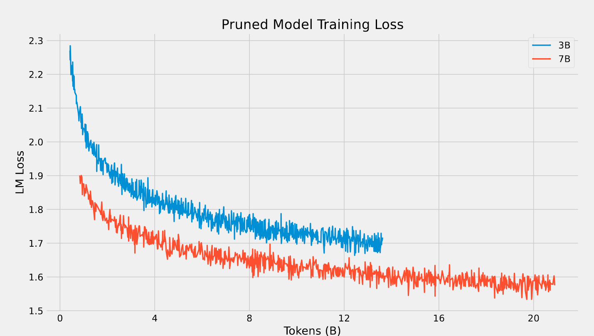

# Megatron Model Pruning and Fine-tuning (llama models only)
[[中文版](README.md)] [[English](README_EN.md)]
## Introduction
This method supports pruning a Transformer pre-trained model to any desired size while retaining most of its performance. For a transformer model, the parameter size is determined by `layer_num, hidden_size, intermediate_size, num_attention_heads`. With this code, you only need to set new values for `drop_layers, hidden_size_remain, intermediate_size_remain`, and `num_attention_heads_remain` to prune the model to a smaller size.

Taking Llama as an example:
| Model | layer_num | hidden_size | intermediate_size | num_attention_heads |
| :--- | :---: | :---: | :---: | :---: |
| LLaMA-13B | 40 | 5120| 13824 | 40 |
| LLaMA-7B | 32 | 4096| 11006 | 32 |
| LLaMA-3.4B | 28 | 3072| 8192 | 24 |
| LLaMA-2.7B | 24 | 2560| 6912 | 20 |

Due to not pruning kv_channel and Llama using SwiGLU-MLP, there is a certain proportional relationship between `hidden_size`, `intermediate_size`, and `num_attention_heads`. It is recommended to choose `hidden_size` first when pruning and then calculate the corresponding `intermediate_size` and `num_attention_heads`.

### Depth Pruning
This method is similar to the classic layerdrop method. By using the `drop_layers` parameter, you can specify the layers you want to prune. In our preliminary experiments, pruning from the middle often causes less damage to the model for a fixed number of pruned layers, and the farther apart the pruned layers are, the less damage to the model. For example, for a transformer with 12 layers indexed from 0, if you need to prune 2 layers, pruning layers 4 and 7 may have a better effect.

### Width Pruning
Set parameters such as `hidden_size, intermediate_size, num_attention_heads`, etc.
This method prunes the original model by structured weight pruning, creating a model of any desired size. For example, for an [n, m] matrix, if it is pruned to a size of [n-a, m-b], it will randomly prune a rows and b columns of parameters.
However, the weight matrices in the Transformer structure have strict dependencies. For example, in the calculation process, for an initial vector x, it will go through multiple layers of the network. For example, $x_1 = x_0AB$ where matrices A and B are multiplied, there are dependencies between rows and columns. For a vector $x_0$ of size `hidden_size`, if the i-th position is pruned, then vectors A and B need to prune the i-th row and column, respectively. This ensures that the calculated result of the pruned matrix remains consistent at positions other than i. This code generates random pruning positions and performs structured pruning according to the calculation method of the transformer.

## Usage
### Step 1
Convert llama's Hugging Face model weights to Megatron model weights
```
bash tools/checkpoint_conversion/hf_to_megatron.sh
```
You can set the `tensor_parallel_size` arbitrarily, and this method supports weight pruning under tensor parallelism.

### Step 2
Megatron model pruning, refer to the script `scripts/prune_llama.sh`
```
bash scripts/prune_llama.sh
```
- `--load`: Path to the Megatron model to be pruned.
- `GPT_ARGS`: Keep all parameters consistent with the original model.
- `PRUNE_ARGS`
    - `--hidden_size_remain`: Pruned `hidden_size`.
    - `--num_attention_heads_remain`: Pruned `attention_heads`.
    - `--ffn_hidden_size_remain`: Pruned `ffn_hidden_size`.
    - `--drop_layers`: Indices of layers to be pruned, starting from 0.
    - `--prune_type`: Default is "balance". Since pruning for larger models is done under tensor parallelism, the rows or columns to be pruned may not be on the same GPU. "balance" pruning ensures that an equal number of rows or columns are pruned on each GPU, making each sub-model exactly the same size. If not using "balance", each sub-model may have different sizes, and the transfer.sh script is needed to convert to a tp1 model.

### Step 3
The pruned model needs a small amount of fine-tuning to recover most of its capabilities.
The script for continuing training the model is as follows:
```
bash scripts/check_model.sh
```

## Large Model Pruning Experiment
We conducted experiments on the popular llama model, pruning llama2-13B to 7B and llama2-7B to 3.5B.

We fine-tuned the pruned models on the open-source Pile dataset.
Below are the specific model parameters and ml loss after fine-tuning:

| Model | layer_num | hidden_size | intermediate_size | num_attention_heads | ml loss |
| :--- | :---: | :---: | :---: | :---: | :---: |
| LLaMA2-13B | 40 | 5120| 13824 | 40 | 1.50 |
| LLaMA2-7B | 32 | 4096| 11006 | 32 | 1.54 |
| Pruned-7B | 32 | 4096| 11006 | 32 | 1.56 (20B tokens) |
| Pruned-3.4B | 28 | 3072| 8192 | 28 | 1.71 (12B tokens) |

### Fine-tuning loss is as follows
#### Comparison of loss after pruning models of different sizes
Training curves



Training table

| Model | 4B| 8B | 12B |16B | 20B |
| :--- | :---: | :---: | :---: | :---: | :---: |
| Pruned-7B | 1.700 | 1.642| 1.616 | 1.587 | 1.553 |
| Pruned-3.4B | 1.839 | 1.746| 1.713 | - | - |

From the training loss, it can be seen that the model has not yet fully converged, and there is still significant room for improvement with more training data.